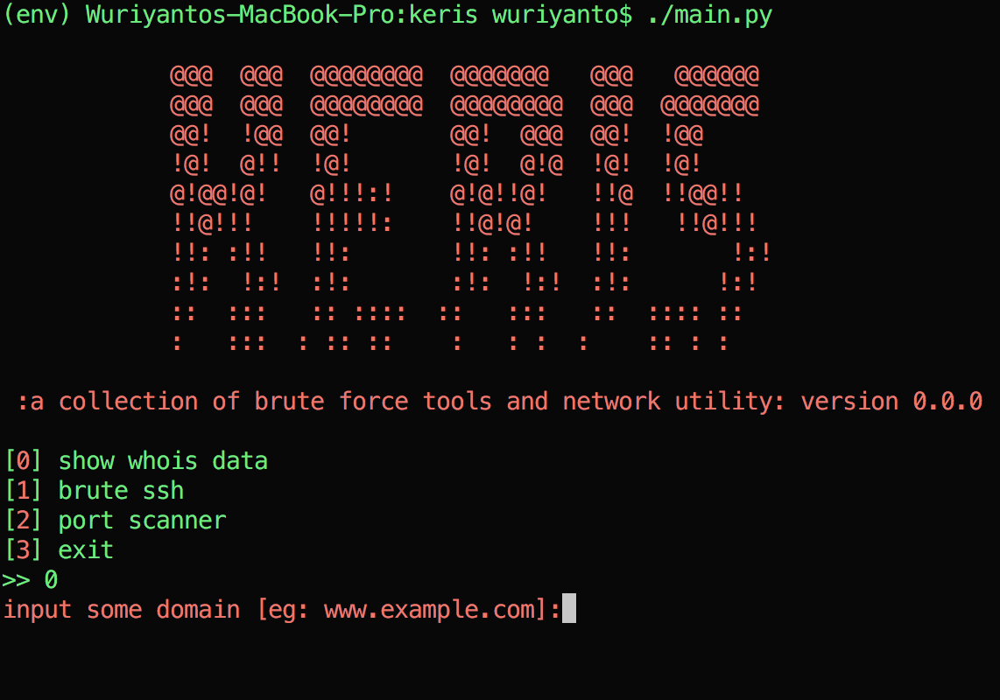

# KERIS

### Original Term
Is an asymmetrical dagger with distinctive blade-patterning achieved through alternating laminations of iron and nickelous iron (pamor).[4] Krises are most strongly associated with the culture of Indonesia. https://en.wikipedia.org/wiki/Kris

## Requirements
- Python 3.7 or higher

## Usage

```shell
$ ./main.py
```

<div align="center">

[](https://github.com/telkomdev/keris)
<br/><br/>
</div>

